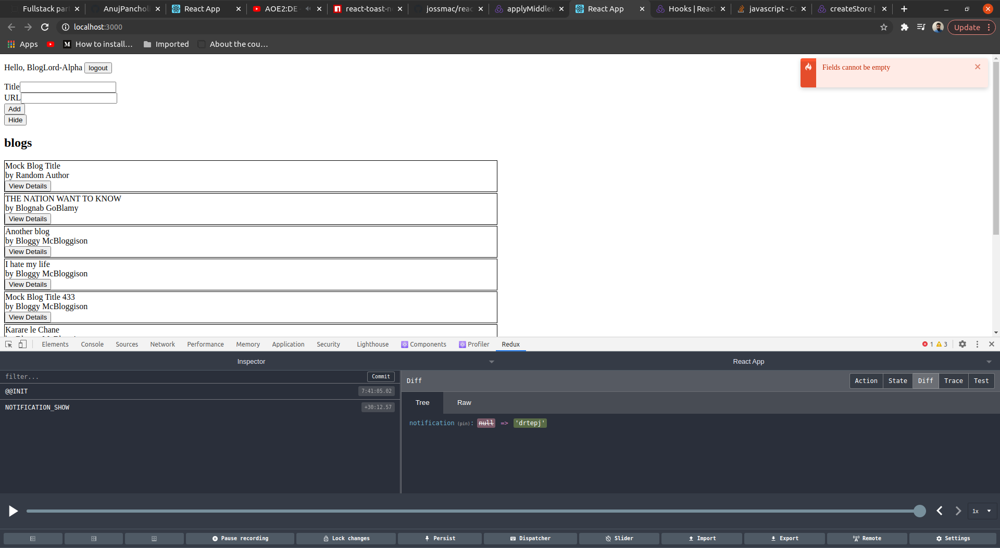

# Part 7

## Exercise 7.1

First of all, all the components given in the starting repo were thrown into one `App.js` file, so had to refactor all of those to their own respective files. Then I could proceed with simply importing the necessary components form `react-router-dom`, implementing it in the desired way.

## Exercise 7.2

In trying to do this, I realised that `useRouteMatch` cannot be used in the same component that contains the router, so I decided to use the `useRouteMatch` hook in the `AnecdoteList` component itself, which would receive all the anecdotes, and then the desired anecdote could be filtered there, which would in turn render the `Anecdote` component.

**Note:** There is an edge case here that was not mentioned - the user may try to manually change the path, and add some id in the URL param that does not exist, which will end up breaking the app. To handle this, I have passed a flag in the `anecdote` object in props of the `Anecdote` component, and if that is true (signifying some invalid id) then some simple text will be shown stating that the anecdote was not found.

## Exercise 7.3

Used the `useHistory` hook to change the path and render notification.

## Exercise 7.4

First step was to make the actual hook, which I did in a new `hooks` directory and an `index.js` file with named exports as suggested in the course, then I simply imported it in the `CreateNew` component that contains the form to create new anecdotes, and used it for each of the fields.

## Exercise 7.5

Simply made a `reset` function in the `useFields` hook, then made a `resetAll` function triggered by a new button which calls `reset` for all fields.

## Exercise 7.6

The warning was avoided, and according to the course, this exercise is already complete.

## Exercise 7.7

The exercise was to implement the `useEffect` hook within the `useCountry`custom hook. I implemented the same, making the required API call if a non-empty name is present passed, and if a result is found, put the first result in the `data` property with a `found` boolean (this seemed to be the format accepted by the existing `Country` component). If no result was found, the API would respond with a status code of 404 and the `found` boolean would be set to false with `data` set to null.

## Exercise 7.8

First I implemented the `useEffect` callback in the `useResource` hook to fetch all the resources via a simple GET request, to then update the `resources` state with the result. Then I implemented the `create` function to make a POST request to create a new resouce, and since this request would return the new resource as created on the backend, I could just update the `resources` state by appending the new resouce to it.

## Exercise 7.9

First I added the `notificationReducer` with some necessary action creators, then added an `index.js` file in reducers directory with a combined reducer (of course at this point there is just one reducer to combine, but there will be more to combine eventually, so adding it now).

At first the format of the state was the following:

```
{
    notification: {
        message: <string>,
        options: <object of options passed to toasts of react-toast notifications>
    }
}
```

This was because I am using the `react-toast-notifications` library so it made sense to store the info to pass to it. I would then just check in whichever component I wanted if the `message` was non-empty, then call the `addToast` function provided by the `useToasts` hook. However, this posed a problem - apparantly `addToast` re-renders the component from which it is called - this method caused an infinite re-rendering which caused the app to eventually break.

So, I went through the docs of the `react-toast-notifications` library and found that the third parameter to pass to `addToast` is a function which takes the `id` of the new toast, so that it can be stored, possibly for passing to `removeToast`. I decided to go with just one property, the id of the new toast stored in the `notification` property of the application's state. Then, when the toast would be dismissed, I would use the `onDismiss` function (passed as an option to `addToast`) to reset this to `null`.

I know that the `notification` property in the state isn't directly causing the notification to show, but to change this I would have to abandon `react-toast-notifications` and that would take too much refactoring.



All the cypress tests are passing at this point.

**NOTE:** I have refactored this, effectively changing the solution to this exercise in 7.11, refer to desctiption of 7.11 for the same.

## Exercise 7.10

I am using the same frontend and backend as I had used in parts 4 and 5, and in those parts I had created a functin `refreshBlogList` which would make the API call to fetch all blogs and populate them in the state of the `BlogListing` component. So, all I have had to do for this exercise is to make an async action creator for populating the blogs, and call `dispatch` using that in the `refreshBlogList` function. This would handle both the cases for this exercise, i.e, ppopulating all blogs and adding a new blog (function is passed as a prop to `BlogEntryForm` which uses that to refresh the blog list after a new blog is created).

**NOTE:** This approach is something I changed later, shifting the functionality to use the backend service in the `blogsReducer` itself.

## Exercise 7.11

I finally refactored the application to stop using `react-toast-notification` and use my own `Notification` component that takes content directly from the redux application state. Also, all invocations to any method of the `blogs` service that interacts with the backend has been shifted to the blogs reducer with async action creators using the `redux-thunk` middleware.

## Exercise 7.12

Implemented the necessary reducer, action creators to store info of logged-in user to store and a `useEffect` in the App component to pick user data from `localStorage`.

## Exercise 7.13

First, made a new endpoint on the backend to aggregate the user stats for the frontend. Then I made a new `users` service which would communicate with the backend to fetch said data. The I implemented routing on the frontend, with just a simple message to be displayed in the required user view, as I was yet to implement the component that would be rendered in this view.

At any given time, we would need to store that data which is to be displayed in the `UserStats` component, used in the user view. So, I invented a new property in the redux store `user_stats` that would store the response of the `/users/stats` API endpoint and implemented the reducer and action creators for it.

Then I implemented the actual `UserStats` component that would show this data in the form of a table. The stats for each user would be dispalyed by a component that renders a table row for that particular user.

**NOTE:** I did not know exactly how to style the table so I copied the css properties off a tutorial, **ONLY the css, NOT any of the code**.

## Exercise 7.14

Added a `UserView` component that fetches user data from `featured_user` property in redux store. Then I added the links in the `UserStats` component to route to the individual user view.

## Exercise 7.15

First step was to add an API endpiont in the backend to return the information of just one blog by its ID. On the frontend, I used `useParams` to fetch the ID of the blog from the URL path, in a new component `BlogView`, then I implemented a reducer for a new property in the redux store, `featured_user` which will be displayed in the said `BlogView` component. The reason I decided to have this be a separate APi call instead of taking one blog out of the `blogs` property in the redux state is because someone can manually put the path of a certain blog in the address bar, so, this should be independent of the `blogs` in the state.

## Exercise 7.16

Have already implemented this.

## Exercise 7.17

First, made one POST and one GET endpoint to receive a new comment and get comments for a given blog respectively. Then implemented a `commentService` file on the frontend for interacting with the backend to fetch the comments. Since the comments will be visible for the `featured_blog`, I decided to make a property in the redux store, `featured_comments` to store the blog for `featured_comments`, and implemented a reducer for it. Then the flow would be that, in case a blog was viewed, first a blog would be populated via `featured_blog`, then its `id` would be retrieved in the `CommentsView` component via the `useSelector` hook and the comments would be fetched into `featured_comments` and populated.

## Exercise 7.18

First made a function in `comments` service to make the POST request to add commment, then made the necessary function in the `featuredCommentsReducer` to change the state. Added a component in `BlogView` to render the form to add the comment.

## Exercise 7.19

Added `materiel-ui` in dependencies, then used the `Button` and `TextField` components in the `LoginForm`. There were some alignment issues, solved with css of my own using flexbox.  


----